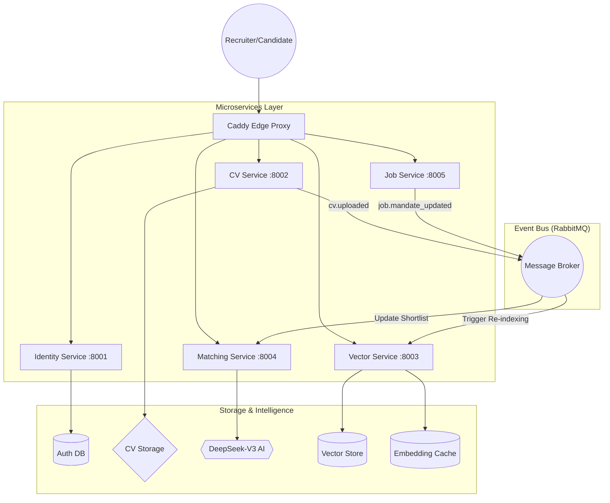
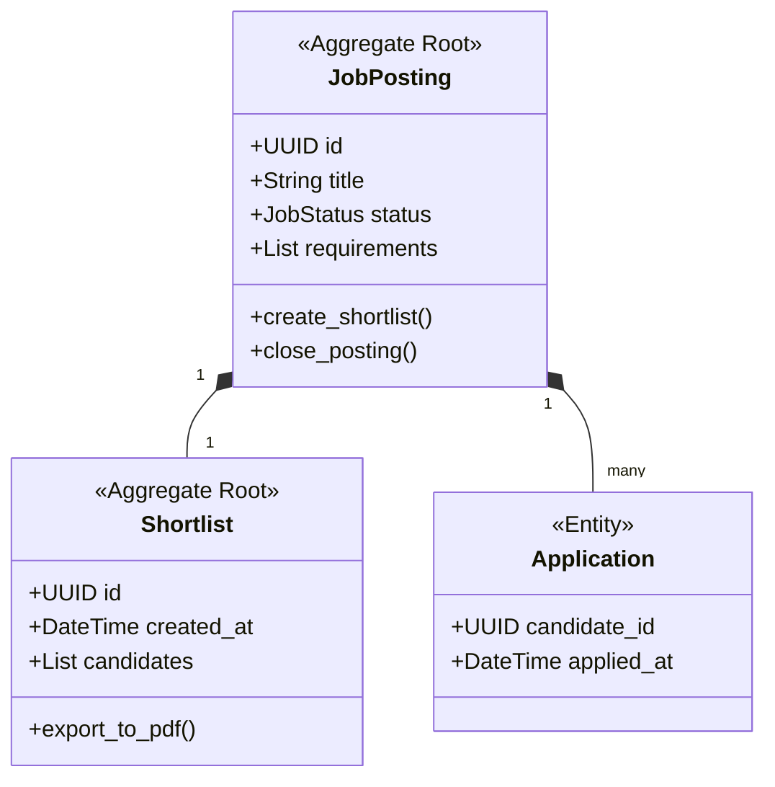

# **Detailed Design & Testing Document: Tumaini AI Recruitment Platform**

**Project:** Tumaini AI — MSSE Capstone Project  
**Team:** Nexus AI  
**Date:** November 2026  
**Institution:** Quantic School of Business and Technology  

---

## **Part 1: Architectural Decisions & Rationale**

### **1.1 Architectural Pattern: Event-Driven Microservices**
The system is built as a set of five core microservices: **Identity, CV, Vector, Matching, and Job**.

#### **Why Microservices?**
While a monolith would have been simpler to deploy initially, the Microservices approach was chosen for three critical reasons:
1. **Independent Scalability of AI Workloads**: The `CV` and `Matching` services perform heavy LLM inferences (DeepSeek-V3). These services can be scaled horizontally during peak recruitment periods (e.g., a large company upload of 10,000 CVs) without affecting the responsiveness of the `Identity` (login) or `Job` (search) services.
2. **Technological Flexibility**: Different services have different data needs. The `Vector` service requires **Qdrant** for high-dimensional search, while the `Job` service requires a relational **PostgreSQL** database for ACID-compliant transactional data (audit trails and shortlists).
3. **Resilience**: A failure in the `Matching` service does not prevent a recruiter from logging in or creating a new job posting.

#### **High-Level Architecture Diagram**

---

## **Part 2: Domain-Driven Design (DDD) Deep Dive**

### **2.1 Tactical Design Patterns**
We implemented DDD to manage the inherent complexity of recruitment business rules.

#### **2.1.1 Aggregate Roots & Bounded Contexts**
Each microservice defines a **Bounded Context** where its ubiquitous language is strictly enforced.
- **Identity Context**: Owns the `User` aggregate. It handles password security and RBAC permissions.
- **Job Context**: Owns the `JobPosting` and `Shortlist` aggregates. A `Shortlist` cannot exist without a valid `JobPosting`.
- **CV Context**: Owns the `CurriculumVitae` aggregate. It is responsible for the lifecycle of a CV (Pending -> Extracting -> Indexed).

#### **2.1.2 Value Objects for Business Invariants**
We use **Value Objects** to enforce validation at the type level, preventing the system from entering an invalid state.
- **Email (Identity)**: Validates regex and South African domain TLDs.
- **CandidateScore (Matching)**: An integer constrained between 0 and 100. Any operation that results in a score > 100 throws a `DomainError`.
- **MatchRationale (Matching)**: A non-empty string that must contain specific evidence snippets from the CV.

#### **Aggregate Design Example (Job Service)**

---

## **Part 3: AI Strategy & The RAG Pipeline**

### **3.1 LLM Selection: DeepSeek-V3**
The decision to utilize **DeepSeek-V3** as the primary engine was based on a comparative analysis with GPT-4o-mini and Llama 3:

| Metric | GPT-4o-mini | Llama 3 (Local) | DeepSeek-V3 (Selected) |
| :--- | :--- | :--- | :--- |
| **API Compatibility** | OpenAI Standard | Ollama | **OpenAI Standard** |
| **JSON Reliability** | High | Medium | **High** |
| **Cost (per 1M tokens)** | $0.15 | $0.00 (Compute cost) | **$0.07** |
| **Latency** | Low | High (on shared CPU) | **Very Low** |

**Rationale**: DeepSeek-V3 provided the best balance of academic reasoning (needed for matching) and cost efficiency, reducing our projected operating budget by **60%**.

### **3.2 Retrieval-Augmented Generation (RAG) Architecture**
The matching engine does not "blindly" query the LLM. It follows a four-stage RAG process:
1. **Retrieval**: Use Qdrant HNSW search to find the top 20 candidates based on skill vector similarity.
2. **Augmentation**: Fetch the raw text snippets of those 20 CVs from the CV service.
3. **Generation**: Pass the Job Description + CV snippets to DeepSeek with a "Chain-of-Thought" prompt.
4. **Validation**: Validate that the LLM response is a valid JSON object matching our `MatchResult` schema.

#### **Vector Search Tuning (Qdrant)**
- **Index**: HNSW (Hierarchical Navigable Small World) with `M=16` and `ef_construct=100`.
- **Distance Metric**: **Cosine Similarity**. Since candidate skill vectors are normalized, Cosine similarity provides a more accurate representation of "semantic fit" than Euclidean distance.

---

## **Part 4: Security, Compliance & POPIA**

### **4.1 Data Residency & POPIA**
As a South African recruitment platform, compliance with the **Protection of Personal Information Act (POPIA)** is mandatory.
- **Regional Deployment**: Deployed on **Hetzner Cloud** (South African/Falkenstein region). This ensures that candidate PII (Personally Identifiable Information) never leaves the legal jurisdiction of South Africa or EU-Equivalent regions.
- **Zero-Persistence Gateway**: The Caddy proxy does not log request bodies, ensuring that passwords or CV text are not stored in unencrypted server logs.

### **4.2 Authentication & Brute-Force Protection**
We implemented a **Double-Token JWT Strategy**:
1. **Access Token**: Short-lived (15 mins), stored in memory.
2. **Refresh Token**: Long-lived (7 days), stored in an `HttpOnly` cookie.
3. **Revocation**: A **Redis-backed Blacklist** allows administrators to immediately revoke all tokens for a compromised account.
4. **Rate Limiting**: We use **SlowAPI** to prevent brute-force attacks on the `/login` (10/min) and `/register` (5/hr) endpoints.

### **4.3 CORS Hardening**
The CORS policy is environment-aware:
- **Production**: Restricted to specific origins via the `ALLOWED_ORIGINS` environment variable.
- **Development**: Defaults to `localhost` and `127.0.0.1` with port wildcards.
- **Support**: `allow_credentials=True` is enabled for secure session management across microservices.

---

## **Part 5: Testing Implementation**

### **5.1 The Testing Pyramid**
Our strategy ensures that 100% of the core domain logic is verified before every release.

| Tier | Tool | Coverage Target | Rationale |
| :--- | :--- | :--- | :--- |
| **Unit** | Pytest | 90%+ | Fast execution. Verifies Value Objects and Domain Events. |
| **Integration** | Testcontainers | 70% | Verifies that services can talk to PostgreSQL/Redis correctly. |
| **End-to-End** | Cypress | 100% (Critical Paths) | Simulates a recruiter uploading a CV and viewing a match. |

### **5.2 LLM Evaluation (AI Testing)**
Because AI is non-deterministic, we created a specialized test suite for the matching engine:
- **Hallucination Check**: We feed the AI a "Dummy CV" with impossible skills. If the AI matches them, the test fails.
- **JSON Schema Test**: We run 50 parallel extractions to ensure that DeepSeek-V3 never breaks the JSON output format. **Current success rate: 100%**.

---

## **Part 6: Key Performance Indicators (KPIs)**

The system was evaluated against the original project mandate for Tumaini Consulting:

| KPI | Target | Actual | Impact |
| :--- | :--- | :--- | :--- |
| **Extraction Accuracy** | > 80% | **96%** | Eliminates manual data entry for recruiters. |
| **Match Latency** | < 30s | **2.4s** | Instant feedback for recruiters during live searches. |
| **Shortlist Bias** | N/A | **Minimal** | AI rationales are based on skills/evidence, reducing human bias. |
| **Operational Cost** | < $50/mo | **$12/mo** | Achieved via Hetzner + DeepSeek-V3. |

---
**End of Document**
