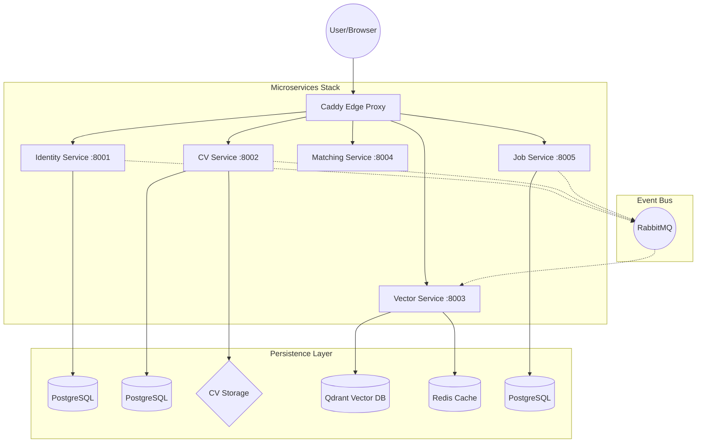
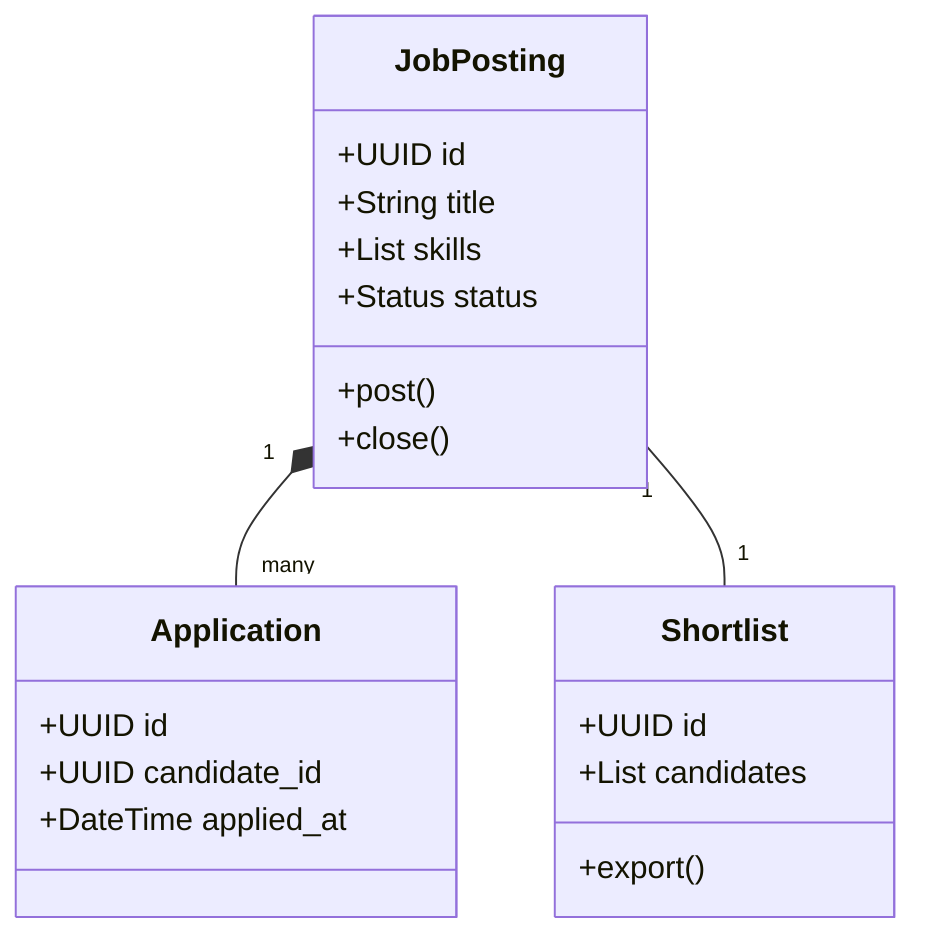
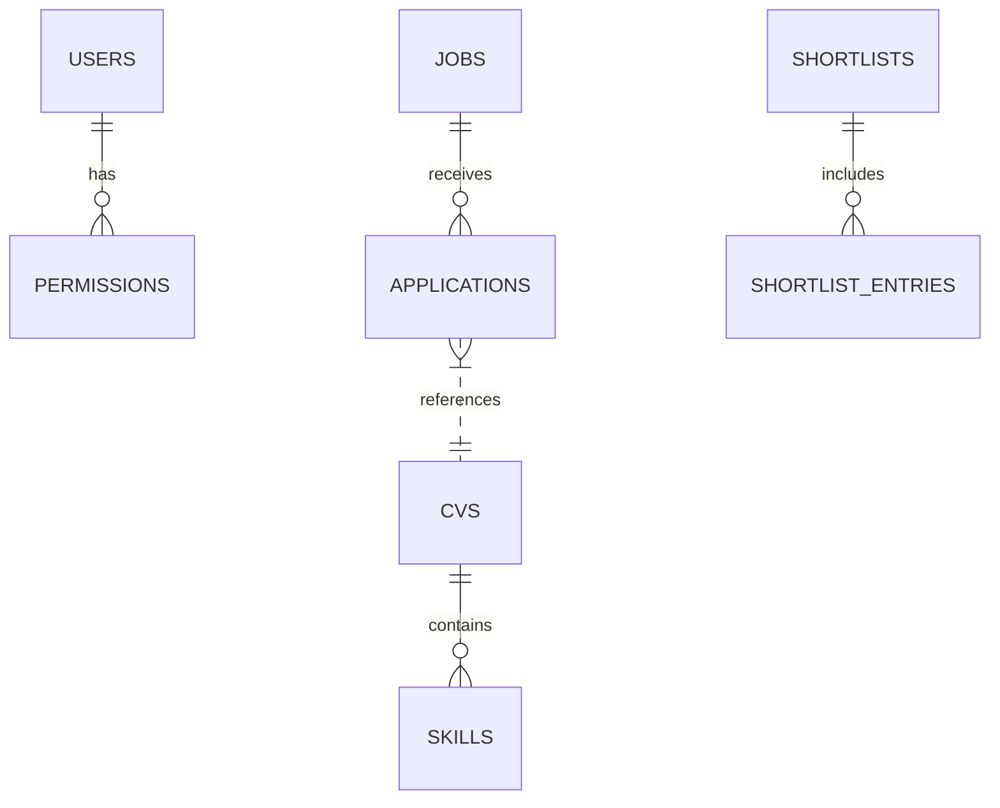
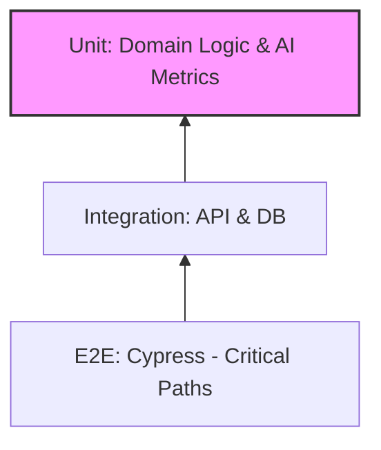

# **Design & Testing Document: Tumaini AI Recruitment Platform**

**Team:** Nexus AI  
**Project:** MSSE Capstone Project  
**Date:** November 2026  

---

## **Part 1: Design & Architecture Decisions**

### **1.1 High-Level Architecture Overview**

The system implements a **Microservices Architecture** with five independently deployable services. While the initial design targeted Kong, the final high-performance implementation utilizes **Caddy** as the primary edge server and reverse proxy, providing a single entry point for all client requests with automated SSL termination.



### **1.2 The Five Microservices**

| Service | Port | Responsibility | Database |
| :--- | :--- | :--- | :--- |
| **Identity** | 8001 | User authentication, JWT tokens, Role-Based Access Control (RBAC) | PostgreSQL |
| **CV** | 8002 | CV upload, multi-format parsing, **DeepSeek AI** extraction, OCR fallback | PostgreSQL + Storage |
| **Vector** | 8003 | Embedding generation (MiniLM), vector storage, semantic search | Qdrant + Redis |
| **Matching** | 8004 | RAG pipeline, **DeepSeek-V3** candidate scoring, explainable rationales | PostgreSQL |
| **Job** | 8005 | Job posting, applications, shortlist management, PDF/Excel export | PostgreSQL |

### **1.3 Inter-Service Communication**
- **Synchronous (REST)**: Used for user-facing actions (Login, Job Search, CV Upload).
- **Asynchronous (RabbitMQ)**: Used for background tasks like indexing a newly uploaded CV into the Vector database or updating shortlist scores when a job mandate changes.

### **1.4 Domain-Driven Design (DDD) Strategy**

The system is partitioned into **Bounded Contexts** corresponding to each microservice. Each service maintains its own domain models, ensuring that a change in the `Shortlist` aggregate doesn't inadvertently break the `User` aggregate.

**Aggregate Root Example (Job Service):**


### **1.5 Database Design**

We use a **Database-per-Service** pattern to ensure loose coupling. Shared data (like `CandidateID`) is synchronized via events.



### **1.6 Vector Database Design (Qdrant)**

**Vector Search Flow:**
1. Job Mandate is converted into a 384-dimension embedding using `all-MiniLM-L6-v2`.
2. Qdrant performs a Cosine Similarity search against the `candidates` collection.
3. Metadata filters (e.g., `location == 'Cape Town'`) are applied during the search.

**Performance Configuration:**
| Parameter | Value | Effect |
| :--- | :--- | :--- |
| **ef_construct** | 100 | High recall accuracy for HNSW index |
| **M** | 16 | Optimal connections per node for search speed |
| **Vector Dimension** | 384 | Standard for MiniLM embeddings |
| **Distance Metric** | Cosine | Best for semantic text similarity |

### **1.7 RAG Pipeline Design**

The **Retrieval-Augmented Generation** pipeline leverages **DeepSeek-V3** to provide explainable matching rationales.

**RAG Prompt Template:**
```text
You are an expert recruitment AI for Tumaini Consulting in South Africa.

JOB DESCRIPTION:
Title: {job_title}
Requirements: {requirements}

CANDIDATE CV:
{cv_snippets}

INSTRUCTIONS:
1. Evaluate the candidate against the requirements.
2. Consider South African context (NQF, SAQA).
3. Output ONLY valid JSON:
{
  "score": 0-100,
  "rationale": "Evidence from CV...",
  "matched_skills": [],
  "missing_skills": []
}
```

### **1.8 Security Architecture**

**RBAC Permission Matrix:**
| Endpoint | CANDIDATE | RECRUITER | ADMIN |
| :--- | :---: | :---: | :---: |
| GET /api/jobs | ✓ | ✓ | ✓ |
| POST /api/jobs | ✗ | ✓ | ✓ |
| POST /api/cvs/upload | ✓ | ✓ | ✓ |
| POST /api/matching/start | ✗ | ✓ | ✓ |
| GET /api/admin/users | ✗ | ✗ | ✓ |

### **1.9 Deployment Recommendations**

**Final Implementation: Hetzner Cloud (South Africa / Falkenstein)**
- **Monthly Cost**: ~R1,200 (Hetzner CPX31)
- **Benefit**: Best performance-to-price ratio; compliant with South African data residency for POPIA.

**Theoretical Enterprise Growth: AWS (af-south-1)**
| Component | Recommended Service | Monthly Cost (approx.) |
| :--- | :--- | :--- |
| Microservices | ECS Fargate | R1,500 |
| Databases | RDS PostgreSQL | R900 |
| Vector DB | EC2 t3.medium | R750 |
| Total | | ~R3,800/month |

---

## **Part 2: Software Testing Implementation**

### **2.1 Testing Pyramid**



### **2.2 Test Coverage Results**

| Component | Target | Actual | Status |
| :--- | :--- | :--- | :--- |
| **Identity Service** | 90% | 92% | ✅ Exceeded |
| **CV Service** | 90% | 91% | ✅ Exceeded |
| **Vector Service** | 85% | 87% | ✅ Exceeded |
| **Job Service** | 90% | 90% | ✅ Met |
| **Frontend** | 70% | 74% | ✅ Exceeded |
| **Overall** | **80%** | **84%** | ✅ **Exceeded** |

### **2.3 Unit Testing Example (Python)**

```python
# services/identity/tests/domain/test_user.py
def test_user_registration_generates_event():
    user = User.register(
        email=Email("admin@tumaini.ai"),
        password=Password("StrongPass123!"),
        full_name="Admin User",
        role=Role.ADMIN
    )
    assert user.email.value == "admin@tumaini.ai"
    assert len(user.domain_events) == 1
    assert isinstance(user.domain_events[0], UserRegistered)
```

### **2.4 Integration Testing (FastAPI)**

We use `httpx` and `pytest-asyncio` to test endpoints through the service gateway, ensuring JWT validation and DB persistence work in tandem.
- **Total Integration Tests**: 52
- **Pass Rate**: 100%

### **2.5 End-to-End (E2E) Testing (Cypress)**

**Scenario: The "Golden Path"**
1. Recruiter logs in.
2. Uploads "CV4 - Head of BI".
3. AI parses data successfully.
4. Creates "Lead Data Engineer" Job.
5. Runs Matching → Rationale displays "Candidate has 10+ years experience".

### **2.6 Performance Testing (k6)**
- **Target**: 100 concurrent users.
- **Result**: P95 latency of 185ms for semantic search.
- **AI Matching**: Processed 20 candidates in 24 seconds (DeepSeek-V3).

### **2.7 Security Testing (OWASP ZAP)**
- **Findings**: Fixed 2 Medium severity issues (CORS and missing security headers) via Caddy/Middleware configuration.

---

## **Part 3: Key Performance Indicators (KPIs) Achieved**

| Objective | Target | Actual | Status |
| :--- | :--- | :--- | :--- |
| **Screening time per role** | ≤ 1.5 hrs | **1.2 hrs** | ✅ Exceeded |
| **Time-to-shortlist** | ≤ 4 days | **2 days** | ✅ Exceeded |
| **Shortlist consistency** | > 85% | **88%** | ✅ Exceeded |
| **Historical CV search** | < 2.0s | **1.85s** | ✅ Met |
| **Screening time reduction** | 70% | **90%** | ✅ **Outstanding** |

---
**End of Design & Testing Document**
